# Graph Time Model (GTM) JAX Simulation Engine

JAX/Flax simulation for field dynamics ($t \to t+1$). Uses **Inject → Filter → Compute → Shift** per step.

## Workflows

**GTM run** (`.agent/workflows/gnn_wf.md`): Load `DEMO_INPUT` from `test.py` → parse JSON into env vars → init `Guard` → `Guard.main()` runs simulation → save `model.safetensors` → verify file exists.

### Workflow tree (all steps)

The diagram below lists every major step from entry point to export. Each box is a function or phase; indentation shows nesting.

```mermaid
flowchart TB
    A["main.py: Guard() → guard.main()"]
    A --> B["Guard.__init__"]
    A --> C["Guard.main() → run()"]

    B --> B1["load_data: get_env_cfg or test_out.json → json.loads"]
    B --> B2["parse_value(cfg)"]
    B --> B3["GNN(amount_nodes, time, gpu, DIMS, **cfg)"]
    B --> B4["BQCore(dataset_id)"]

    C --> D["gnn_layer.main()"]
    D --> E["_export_engine_state(serialized_in, serialized_out)"]

    D --> F["prepare()"]
    F --> F1["db_layer.build_db(amount_nodes)"]
    F1 --> F1a["Per dim: db_dim ndarray → tree_db"]
    F1 --> F1b["nodes concat tree_db, SCALED_PARAMS, tdb, time_construct"]
    F --> F2["prep()"]
    F2 --> F2a["Per eq: extract_eq_variations, reshape_variant_block"]
    F2 --> F2b["get_axis_shape, short_transformed, all_axs/all_shapes"]
    F2 --> F2c["create_in_linears_process → build_linears"]
    F2 --> F2d["create_out_linears_process → create_out_linears"]
    F2 --> F2e["in_store/out_store; create_node → METHODS"]

    D --> G["simulate()"]
    G --> G1["Per step: begin_step(step)"]
    G --> G2["calc_batch()"]
    G2 --> G2a["Per eq: extract_eq_variations, short_transformed, extract_flat_params"]
    G2 --> G2b["create_in_features → get_precomputed_results, shape_input"]
    G2 --> G2c["blur_result_from_in_tree → node() → create_out_features"]
    G2 --> G2d["all_results"]
    G --> G3["save_t_step(all_results)"]
    G3 --> G3a["flatten_result → sum_results"]
    G3 --> G3b["stack_tdb → sort_results_rtdb"]
    G3 --> G3c["time_construct update"]
    G --> G4["Optional: surrounding_check, divide_time_values_all_dims"]

    D --> H["serialize(in_store), serialize(out_store)"]
    D --> I["return serialized_in, serialized_out"]

    E --> E1["payload: serialized_in, serialized_out, tdb"]
    E --> E2["_upsert_generated_data_to_bq(payload)"]
    E --> E3["Write engine_output.json"]
```



**Text tree (same steps, linear view):**

```
main.py
└── Guard()
    ├── __init__
    │   ├── load_data()  [BQ get_env_cfg or test_out.json → json.loads]
    │   ├── parse_value(cfg)
    │   ├── GNN(amount_nodes, time, gpu, DIMS, **cfg)
    │   └── BQCore(dataset_id)
    └── main()
        └── run()
            ├── gnn_layer.main()
            │   ├── prepare()
            │   │   ├── db_layer.build_db(amount_nodes)
            │   │   │   ├── Per dim: db_dim ndarray → tree_db; nodes = concat(tree_db)
            │   │   │   ├── TIME_DB = flatten(time_db_by_dim); SCALED_PARAMS, tdb, time_construct
            │   │   └── prep()
            │   │       ├── For each eq: extract_eq_variations, reshape_variant_block, get_axis_shape, short_transformed
            │   │       ├── create_in_linears_process → build_linears; in_store
            │   │       ├── create_out_linears_process → create_out_linears; out_store
            │   │       └── create_node → METHODS[eq_idx]
            │   ├── simulate()
            │   │   └── For step in range(time):
            │   │       ├── feature_encoder.begin_step(step)
            │   │       ├── calc_batch()
            │   │       │   └── For each eq: extract_eq_variations → create_in_features → get_precomputed_results
            │   │       │       → shape_input, blur_result_from_in_tree → node() → create_out_features → all_results
            │   │       └── db_layer.save_t_step(all_results)
            │   │           ├── flatten_result → sum_results → stack_tdb → sort_results_rtdb
            │   │           └── time_construct update
            │   │       Optional: surrounding_check; divide_time_values_all_dims(divisor)
            │   ├── serialize(in_store), serialize(out_store)
            │   └── return serialized_in, serialized_out
            └── _export_engine_state(serialized_in, serialized_out)
                ├── payload (serialized_in, serialized_out, tdb)
                ├── _upsert_generated_data_to_bq(payload)
                └── engine_output.json
```

### Logical workflow (all necessary steps)

1. **Load and parse:** Load config (BQ or `test_out.json`), parse JSON, set env / cfg.
2. **Initialize Guard and GNN:** Guard builds GNN with cfg; GNN creates DBLayer, FeatureEncoder, Injector; DBLayer holds DB params and shapes.
3. **Build DB (per-dim):** `build_db(amount_nodes)` builds for each dim a separate ndarray and saves `tree_db = [db_0, db_1, ...]`; sets `nodes` (concat of tree_db for compat), `SCALED_PARAMS`, cumsums, `tdb`, `time_construct`, `time_db_by_dim`.
4. **Prep equations:** For each equation: extract variations, axis/shape, build in/out linears and stores, create Node (with `surrounding_check` available), register in METHODS.
5. **Simulation loop (per step):**
   - Begin step (`feature_encoder.begin_step`).
   - Optional: Compute neighbor index map from schema_grid + SHIFT_DIRS; call `Node.surrounding_check` or GNN `surrounding_check_with_node` where needed (e.g. blur or validation).
   - Calc_batch: for each eq, extract params, create in/out features, get precomputed results, run Node, append results.
   - save_t_step: flatten → sum → stack_tdb → sort_results_rtdb → update time_construct.
   - Optional: `divide_time_values_all_dims(divisor)` (e.g. after each step or once at end).
6. **Serialize and export:** Serialize in_store/out_store, return; Guard calls `_export_engine_state` (payload with serialized in/out, tdb), upsert BQ, write engine_output.json.

## Key components

- **GNN**: Global state, simulation loop, injections.
- **GnnModuleChain**: Sequence of `Node` modules (one JAX block).
- **Node**: Physics unit; equations + state via `nnx.Module`.

## Done (checkbox)

- [x] **Iterator + time ctlr** – Stable architecture: all functions on any time data. `build_time_ctlr(in_store, out_store)` → ctlr `(in_grid, out_grid)`. Iterator methods: `locate_feature(feature, ctlr)`, `inject_time_loop(feature, ctlr, loop_score)`, `scan_in_out_features(ctlr)`, `pattern_recall(param_grid, time_map)`. Simple JAX/lax/vmap, minimal branching, no string values.

## TODOs

- [x] **Scan in/out features → scores + index within time step** – Implemented in `Iterator.scan_in_out_features(ctlr)` with time ctlr.
- Track energetic time distribution over time
- Implement a blur to pre fill results based on in feature line (to not require calcualtion) -> Benedikt is on this
- Time Iterator: The Model builds on time (There is no Room -> just time is what matters)
- Implement total tiem step feature
- model payload um ctlr section erweitern 
- test switch
## Time engine (todo / ideas)

**Current plan**

- **Alternative reality** – When a feature matches a past one (e.g. via blur), mark the equation branch as “alternative reality” so the model can validate time steps and optionally create new ones (zero-shot prediction).

**Motivation**
Die erde ist nur ein node.  Wenn wir das megnetfeld kontrollieren dann können wir die Welt an jedem Ort durch gezielte Manipulation der Frequenz verändern (-> Komponenten nachbauen (double pendulum(alle smechanisch?)) , wir könnten mit der Sonne (dem parent node) kommunizierenn und so einen positiven Einfluss auf höhere Layer nehmen -< Über die Zeit kommen wir überall hin: 
** todo **
- **Time Travel =** ( dt = 0;  amount_nodes * dims * e/node (=self.pattern) * schwellwert (=argmax((sum(prev_time_feature_store) / dims (=time step (ts) set) -> sum(item.nodes[item.index:100].e)) / dt) ))
- **Reality tags / branch IDs** – Persist a `reality_id` or `branch_id` per (eq, t, param) when we reuse a precomputed result; use it later for validation and analytics.
- **Time-step consistency check** – After each step, compare “alternative reality” nodes to the branch they came from (e.g. same feature → same outcome); flag or log drift.
- **Zero-shot horizon** – For nodes marked alternative reality, try predicting one or more future steps without running the full equation (e.g. copy from reference branch or small head).
- **Rollback / replay** – Store enough state (or hashes) per branch so we can rollback to a given `t` or replay from a past “reality” for debugging or counterfactuals.
- **Interpolation between time steps** – Optional interpolation (e.g. linear or learned) between `t` and `t+1` for smoother trajectories or denser logging.
- **Confidence / uncertainty over time** – Attach a simple confidence or uncertainty (e.g. distance to nearest blur match, or variance over similar past steps) to decide when to trust “alternative” vs recompute.
- **Canonical vs alternative** – Define one “canonical” reality per run (e.g. first branch or main path) and treat others as alternatives; validate alternatives against canonical at same `t`.
- **Cross-step invariants** – Define cheap invariants (e.g. conservation, bounds) and check them at each step; invalidate or flag alternative realities that break invariants.
- **Minimal state for validation** – Store only the minimal state needed to re-validate a time step (e.g. inputs + equation id + blur ref); use for offline checks without full replay.
- **Die Bewegung durch den Raum ist eigentlich eine Folge von Zustandsänderungen über die Zeit. -> meine jetzige Zeit legt alle möglcihketien fest.**
- **The grid is just an building block which creates time steps. The true goal is to identify persistent patterns over time -> controll the next time step (live energy injections)**
- **die spirale der Kugel bechirebt nur das Ergebniss, (der letzte zeitschritt legt den nächsten fest) nicht die computation dahinter)**
- **Jeder Zeitschritt trägt die momentane state in den nächten über nur die Veränderung wird berechent**

**Environment / pattern idea (English)**

- The environment influences my pattern (just like thoughts) – it changes patterns in a natural way. Is that \"cheating\"? Everything originates from a single energy injection. This project aims to identify those patterns and inject them into our time.

---

License:
All money earned with it must be collected within the POT


*Keep `test_out.json` at repo root. Use Cursor for nested todo rollup.*
